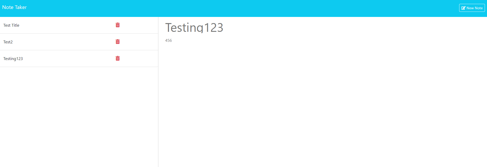

# Note-Taker

##Description

This is a note taking application. When a user uses this app, they will be prompted to enter a title for a task and right below it enter the description of what the task is. Once entered, the user's tasks will be saved on teh left hand side wherre they can either enter in a new task or delete a task they have already entered. Each entered task will be saved as well a user logs back into the application. This application was built with express.js and nodemon. 

To access, copy the repository in github, then use the git clone function in command line to clone this repository into your local machine.

##Usage

Link below:

https://devbelle-note-take-e7a3ea5c0391.herokuapp.com/notes

##Credits

All commits and changes to this assignment were implemented by Devin Belle

##License

N/A

##Features

This Note Taker requires express.js and needs node.js in order to execute intially without the provided heroku link.

##Tests

Run nodemon or node.js to test if all the application's scripts work.
